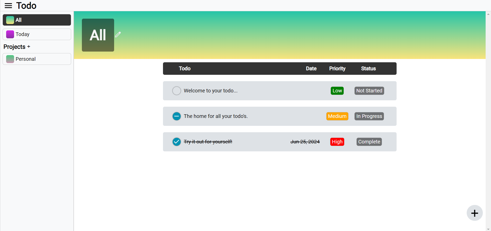
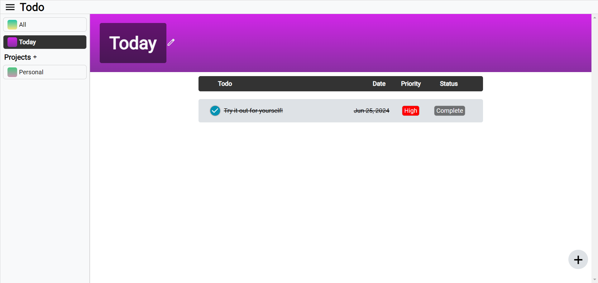

# todo-list

### Description

This project was developed with the intent of practicing concepts and tools such as SOLID, npm, ESLint, Webpack, localStorage and JavaScript classes. It's a simple todo app that keeps track of all your important tasks and stores them for you.

#### Features

- Each todo can be assigned a . . .

  - Project
  - Due Date
  - Status
  - Priority

- All todos and projects have create, edit and delete capabilities.

- The "All" and "Today" projects are pinned projects which always stay on the application.

Give it a try!

#### Live Link: https://hpagon.github.io/todo-list/

### Resources

- Google Fonts and Material Icons: https://fonts.google.com/
- The Odin Project: https://www.theodinproject.com/
