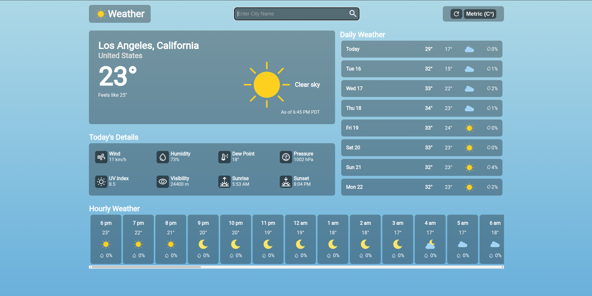
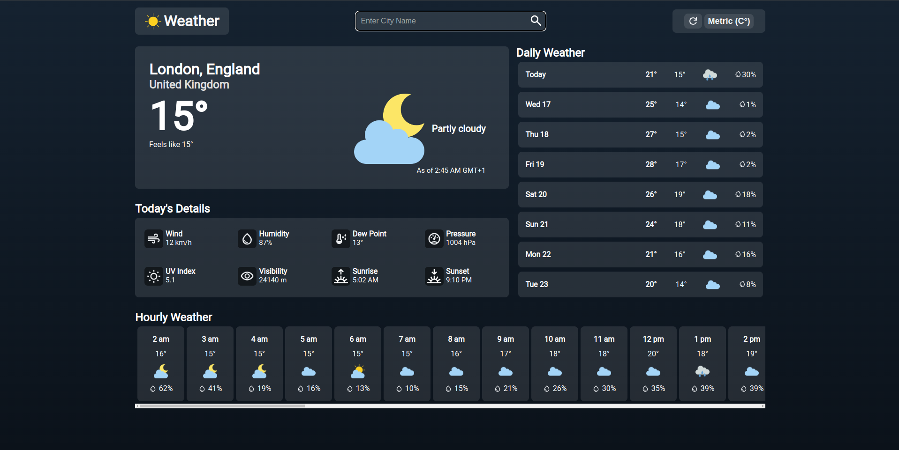

# weather-app

### Description

This is a simple weather application made with the purpose of using the fetch API, promises and the async/await syntax.

The application is pretty simple; enter any city or location you would like or select from any one of the drop down results. Metric and Imperial unit conversions are provided for accesibility. A refresh button is also present in case you want to see the latest weather data.

#### Live Page: https://hpagon.github.io/weather-app/

### Resources

- Font and Icons: https://fonts.google.com/
- Weather icons created by iconixar
  <a href="https://www.flaticon.com/packs/weather-161?word=weather" title="cloud icons"> - Flaticon</a>
